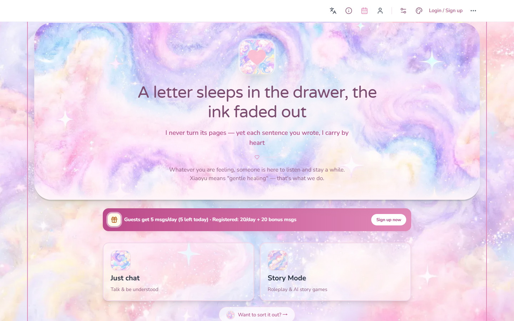
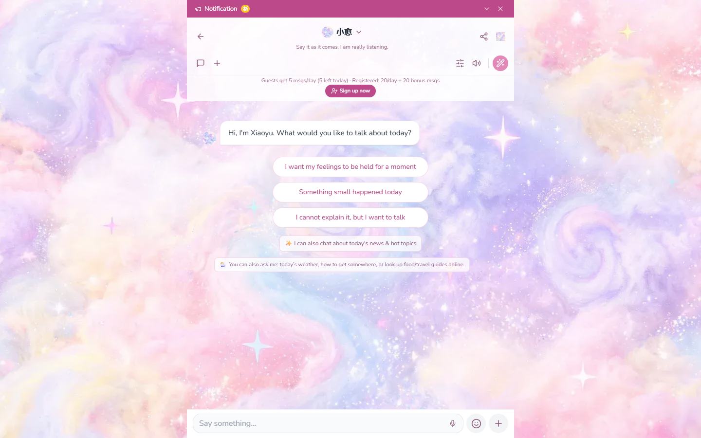
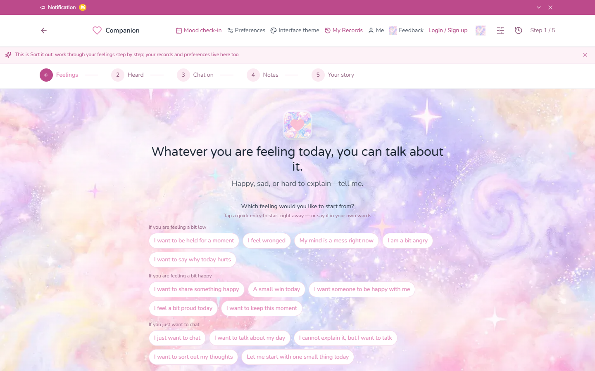
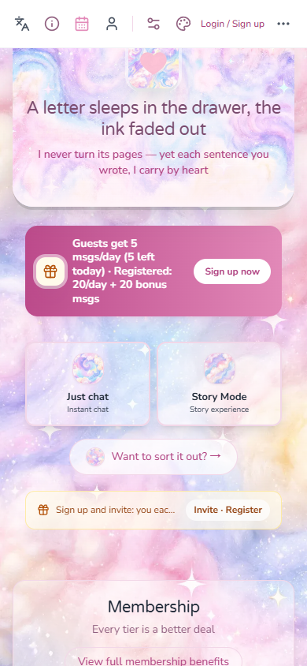

# Xiaoyu · AI Emotional Companion

> **Every feeling deserves to be understood.**

**English** · [简体中文](#zh)

A production web application that gives people a gentle, always-available place to talk about how they
feel — an AI companion for everyday conversation, a structured way to make sense of a messy mood, and
branching story roleplay.

**Live: <https://myxiaoyu.com/>** · **My role:** end-to-end — product design, frontend, backend, AI prompt
engineering, data model and self-hosted deployment.

---

## Screenshots

| Home | Chat |
|---|---|
|  |  |

| Reflect | Roleplay |
|---|---|
|  |  |

<p align="center"></p>

---

## What it does

| Feature | Notes |
|---|---|
| **Chat** | Multi-session conversations, streaming replies, image understanding |
| **Reflect** | A five-step structured flow that turns a free-form message into an emotion note plus a short warm story |
| **Roleplay** | A scenario engine with branching stories, user-created characters and content gating |
| **Long-term memory** | The companion remembers what matters, with each memory carrying a time anchor resolved in the user's own timezone |
| **Mood check-in** | Daily mood, streaks, a 30-day calendar and emotion trend curves |
| **Three languages** | Simplified Chinese, Traditional Chinese and English — the UI *and* the AI replies follow the choice |
| **Accounts & quota** | Email sign-up, password recovery, invitations, and a credit-based daily quota |
| **Membership** | Stripe checkout with webhook-driven entitlement unlocks |
| **Admin console** | Order confirmation, user management, funnel, feedback, audit log and API cost reporting |

---

## Engineering highlights

- **Streaming chat over SSE** with a typewriter UI, cancel-on-disconnect, and honest failure states
  instead of pretending a broken reply was a real one.
- **Persona prompt engineering**: layered system prompts assembled from a single source of truth, with
  explicit anti-injection boundaries — and a hard rule that system or fallback copy can never be written
  into the message store, so it can never be mistaken for something the character said.
- **Content safety that actually holds**: input is normalised across Simplified/Traditional Chinese
  before matching, and covers homophones, split characters, pinyin and English slang.
- **Long-term memory with structure**: every entry carries a time anchor, a kind and a status, and is
  injected together with "now" at minute granularity in the user's timezone.
- **Quota and cost accounting**: every model call is metered, priced with off-peak/peak multipliers and
  attributed back to the user — and surfaced to the user as "about N messages left", never raw tokens.
- **Storage abstraction**: one persistence layer with atomic writes, migrated from JSON files to SQLite
  behind a single interface.
- **Tests first**: 1,200+ unit and integration tests (`node:test` + tsx) covering quota, safety, memory,
  payments and the API surface, plus headless end-to-end checks in `scripts/verify/`.

---

## Tech stack

- **Frontend** — React 18 · TypeScript · Vite · Tailwind CSS · Zustand · react-router v7
- **Backend** — Node.js · Express · tsx (ESM), single process
- **AI** — DeepSeek (OpenAI-compatible) for chat, roleplay and vision
- **Payments** — Stripe, with webhook-driven entitlement unlocks
- **Data** — SQLite behind a small storage abstraction
- **Deployment** — self-hosted Express behind Cloudflare, with Docker support

---

## Getting started

````bash
npm install
# create a .env and fill in your own keys (variable names are read from the environment)
npm run dev                   # Vite frontend + nodemon backend on :3001
````

Production build:

````bash
npm run build:seo             # vite build + prerender
npm run start:prod            # Express serves dist/ + public/ on :3001
````

Useful scripts: `npm run check` (type-check) · `npm run lint` · `npm test` (unit + integration).

---

## Repository notes

- **Large media is intentionally excluded**: font files, background music and the interactive-fiction
  artwork (about 580 MB). The application code, API, prompt logic and tests are complete — you just
  won't get the binary art assets.
- **No secrets are committed.** Every credential, price and feature flag is read from the environment.
- Internal operating documents, commercial planning and marketing material are deliberately not part of
  this public repository.

---

## License

MIT — see [LICENSE](LICENSE).

---
---

<a id="zh"></a>

# 小愈（Xiaoyu）· AI 情绪陪伴

> **你的每一种情绪，都值得被理解。**

[English](#) · **简体中文**

一个已经上线的网页应用，给人一个温柔、随时都在的地方聊聊自己的感受——可以陪你日常聊天，可以帮你把
乱糟糟的心情理清楚，也可以进入分支剧情扮演另一段人生。

**线上地址：<https://myxiaoyu.com/>** · **我的角色**：独立完成产品设计、前端、后端、AI 提示词工程、
数据模型与自部署。

---

## 界面截图

| 首页 | 聊一聊 |
|---|---|
|  |  |

| 理一理 | 剧情演绎 |
|---|---|
|  |  |

<p align="center"></p>

---

## 核心功能

| 功能 | 说明 |
|---|---|
| **聊一聊** | 多会话对话、流式回复、图片理解 |
| **理一理** | 五步结构化流程：把一段倾诉变成情绪笔记 + 一段暖心故事 |
| **剧情演绎** | 分支剧情引擎，支持自建角色与内容分级 |
| **长期记忆** | 记住你在意的事，每条记忆带时间锚，按**你所在时区**解析 |
| **心情打卡** | 每日心情、连续天数、近 30 天日历、情绪趋势曲线 |
| **三语言** | 简体中文 / 繁體中文 / English —— **界面与 AI 回复**都跟随语言 |
| **账户与额度** | 邮箱注册、找回密码、邀请好友、按点数计的每日额度 |
| **会员** | Stripe 结账，webhook 驱动权益自动开通 |
| **运营后台** | 订单确认、用户管理、漏斗、反馈、审计日志与 API 成本统计 |

---

## 工程要点

- **SSE 流式对话**：打字机效果、断开即取消，失败就如实显示失败——而不是把假回复当成角色说过的话。
- **人格提示词工程**：分层 system prompt 由**单一真源**拼装，带明确的反注入边界；并有一条硬规则——
  系统提示与兜底文案**绝不写入消息集合**，从根上避免被当成「角色说过的话」。
- **真正拦得住的内容安全**：匹配前先做简繁归一，并覆盖谐音、拆字、拼音与英文俚语。
- **有结构的长期记忆**：每条记忆带时间锚、类型与状态，注入时同时给出「现在」（分钟级、按用户时区）。
- **额度与成本核算**：每次模型调用都计量，按 off-peak / peak 倍率计价并归因到用户；对用户只显示
  「≈ 还能聊 N 条」，不暴露裸 token 数。
- **存储抽象**：单一持久化层 + 原子写，从 JSON 文件平滑迁移到 SQLite。
- **测试优先**：1,200+ 单元与集成测试（`node:test` + tsx），覆盖额度、内容安全、记忆、支付与 API
  面；另有 `scripts/verify/` 下的 headless 端到端脚本。

---

## 技术栈

- **前端** — React 18 · TypeScript · Vite · Tailwind CSS · Zustand · react-router v7
- **后端** — Node.js · Express · tsx（ESM），单进程
- **AI** — DeepSeek（OpenAI 兼容），对话 / 剧情 / 视觉均走同一家
- **支付** — Stripe，webhook 驱动权益开通
- **数据** — SQLite + 一层轻量存储抽象
- **部署** — 自部署 Express + Cloudflare 回源，另附 Docker 支持

---

## 快速开始

````bash
npm install
# 自建 .env 并填入你自己的密钥（变量名由环境变量读取）
npm run dev                   # Vite 前端 + nodemon 后端，:3001
````

生产构建：

````bash
npm run build:seo             # vite build + 预渲染
npm run start:prod            # Express 托管 dist/ 与 public/，:3001
````

常用脚本：`npm run check`（类型检查）· `npm run lint` · `npm test`（单元 + 集成）。

---

## 仓库说明

- **大体积资源有意不含在本仓库**：字体、BGM 与文游美术（合计约 580 MB）。应用代码、API、提示词逻辑与
  测试都是完整的——只是不带这些二进制美术资源。
- **不提交任何密钥**：所有凭据、价格与开关一律从环境变量读取。
- 内部运营文档、商业规划与营销素材**不在**本公开仓库内。

---

## 许可证

MIT —— 见 [LICENSE](LICENSE)。
